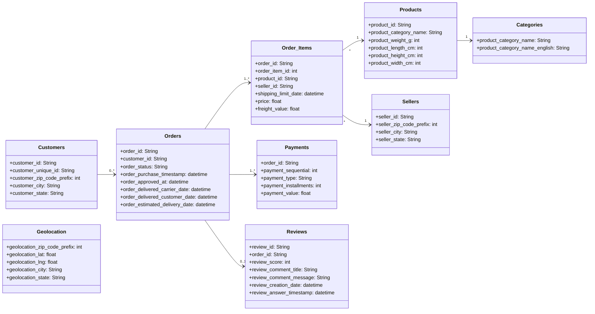

# Desafio Técnico - Bootcamp Triggo.AI 2025

Este repositório contém a solução desenvolvida por Thiago Vinicius B. dos Santos para o desafio técnico do programa de trainee da **triggo.ai**, focado em Engenharia de Dados e DataOps. O projeto analisa o **Brazilian E-commerce Public Dataset by Olist**, utilizando Python, SQL, visualizações e boas práticas analíticas.

---

## Como Executar o Projeto

1. Clone o repositório
2. Instale as dependências
3. Execute o Anaconda Navigator
4. Execute o jupyterlab
5. Abra o arquivo Analytics.ipynb

## Principais Resultados

a) Volume de Pedidos por Mês — Sazonalidade
Foi identificada uma sazonalidade clara nas vendas:

- Aumento significativo de novembro a janeiro (Black Friday, Natal e Ano Novo)

- Nova alta entre fevereiro e março (férias escolares)

- Queda entre março e abril (início do período letivo)

- Estabilização entre maio e junho

- Crescimento entre junho e agosto (Dia dos Namorados, São João, férias de meio de ano)

b) Distribuição do Tempo de Entrega

- A maioria dos pedidos é entregue entre 7 e 15 dias após a compra.

- Contudo, há uma parcela significativa de pedidos com entrega superior a 20 dias, indicando gargalos logísticos em determinadas regiões ou perfis de vendedores.

c) Relação entre Frete e Distância

- Há uma relação positiva entre distância e valor do frete.

- No entanto, a análise revelou alta dispersão: fretes elevados também foram observados em distâncias curtas.

- Fatores como peso do produto, tipo de entrega e categoria também influenciam o custo do frete.

d) Categorias com Maior Faturamento

As 5 categorias com maior volume de faturamento foram:

1. Beleza e Saúde

2. Relógios e Presentes

3. Cama, Mesa e Banho

4. Esporte e Lazer

5. Computadores e Acessórios

# Soluções de Negócio

## 1) Análise de Retenção de Clientes
    
O e-commerce analisado possui 2.997 clientes recorrentes de um total de 96.096 clientes únicos, resultando em uma taxa de recorrência de apenas 3,12%.

Insights:
1. A maioria dos clientes compra apenas uma vez, o que indica baixa fidelização e possível desperdício de investimento em aquisição de novos clientes.

2. A empresa carece de estratégias de retenção, como:

- Campanhas de remarketing

- Descontos para segunda compra

- Programas de cashback e e-mails personalizados

3. Clientes recorrentes tendem a ser mais lucrativos:

- Compram com mais frequência

- Gastam mais por pedido

- Confiam mais nos serviços

4. É possível classificar categorias com mais recorrência, como por exemplo:

- Beleza e Saúde com maior frequência

- Móveis com comportamento mais pontual

5. A taxa de 3,12% pode servir como linha de base para testar campanhas e medir o ROI ao longo do tempo.

## 2) Predição de Atraso na Entrega

Foi desenvolvido um modelo de classificação (Regressão Logística) para prever se um pedido será entregue com atraso, considerando variáveis como tempo estimado, tempo real de entrega e status da entrega.

#### Resultados:
1. Acurácia geral: 75%, indicando bom desempenho aparente.

2. Recall para atrasos: 0.00, ou seja, o modelo não conseguiu identificar corretamente quase nenhum pedido atrasado.

3. Suporte: Houve desequilíbrio entre as classes, com mais de 26 mil pedidos não atrasados contra apenas 2.341 atrasados, favorecendo a classe dominante.

4. A matriz de confusão mostra que o modelo tende a classificar tudo como "Não Atrasado", resultando em 2.335 falsos negativos (pedidos atrasados classificados como não atrasados).

## 3) Segmentação de Clientes (Clustering)

Foi realizada uma análise de agrupamento (KMeans) com base no valor total gasto por cliente, resultando em 4 clusters distintos:

*Análise Gráfica:*

***Cluster 1***: Clientes com maior gasto total, incluindo outliers com compras acima de R$ 5.000,00.

***Clusters 0 e 2***: Clientes com gastos moderados, mas com perfil fiel e ativo.

***Cluster 3***: Clientes com menor gasto, muitos abaixo de R$ 500,00, indicando baixa atividade ou abandono.

*Classificação dos Perfis:*

| Cluster | Perfil                     | Comportamento                                          |
| ------- | -------------------------- | ------------------------------------------------------ |
| 1       | Clientes Premium           | Alto gasto, poucos clientes, maior potencial de compra |
| 0       | Clientes em Crescimento    | Gasto médio, potencial de fidelização                  |
| 2       | Clientes Sazonais          | Compram esporadicamente, valor moderado                |
| 3       | Clientes Inativos/Iniciais | Gasto baixo, possível abandono                         |

#### Estratégias por Cluster:
Cluster 1 – Clientes Premium

- Programas de fidelidade VIP

- Descontos exclusivos e pré-lançamentos

- Atendimento personalizado

Cluster 0 – Clientes em Crescimento

- Estímulos como promoções, combos e brindes

- Frete grátis progressivo ou cashback

Cluster 2 – Clientes Sazonais

- Campanhas em datas comemorativas

- E-mails personalizados com base em histórico de compra

Cluster 3 – Clientes Inativos

- Campanhas de reativação (ex: “sentimos sua falta”)

- Cupons de retorno

- Pesquisas para entender o motivo do abandono

## 4) Análise de Satisfação do Cliente

Foram analisadas as notas de avaliação dos pedidos e sua relação com fatores como tempo de entrega, preço do produto e categoria. 

Os insights foram obtidos a partir de gráficos comparativos.

1. Tempo de Entrega x Nota de Avaliação

- Clientes que deram notas baixas (1 ou 2) tiveram pedidos com tempos de entrega mais longos.

- Já quem deu nota máxima (5) geralmente recebeu os pedidos mais rapidamente.

- Conclusão: o tempo de entrega é um dos principais fatores que impactam negativamente a avaliação. Quanto mais rápido o pedido chega, maior a chance de uma boa avaliação.

2. Valor do Produto x Nota de Avaliação

   
- A análise mostra que preços mais altos não garantem avaliações melhores.

- O valor do produto não tem relação direta com a nota.

- Clientes parecem avaliar com base na experiência de entrega e atendimento, e não no preço.

3. Categorias com Melhores Avaliações

As 5 categorias com notas médias mais altas foram:

1. Moda Infantil (fashion_childrens_clothes)

2. CDs e DVDs Musicais (cds_dvds_musicals)

3. Livros de Interesse Geral (books_general_interest)

4. Flores (flowers)

5. Eletrodomésticos – Forno e Café (small_appliances_home_oven_and_coffee)

## Visualizações Interativas

1. Dashboard Geral – Evolução das Vendas ao Longo do Tempo
- Dashboard interativo com filtros por estado e categoria de produto.

- Permite visualizar a evolução dos pedidos ao longo do tempo por região e segmento de mercado.

- Utiliza plotly.graph_objects com múltiplos traces ativados via dropdown.

Insights:

- Identificação de picos de vendas sazonais.

- Permite aos gestores ajustar estoques ou campanhas conforme tendências temporais e regionais.

  
2. Mapa de calor mostrando concentração de pedidos por estado.
- Representação geográfica da quantidade de pedidos por estado brasileiro.

- Utiliza scatter_geo com escala de cor baseada no volume de pedidos.

Justificativa do Gráfico:

- O gráfico de dispersão geográfica facilita a visualização espacial dos dados.

- Permite identificar rapidamente onde está a maior concentração de vendas, útil para planejamento logístico e estratégias regionais.

3. Gráfico de dispersão relacionando avaliação e tempo de entrega.
- Gráficos do tipo boxplot mostram a distribuição do tempo de entrega em função das notas de avaliação.

Insights:

- Quanto maior o tempo de entrega, menor a nota média atribuída pelo cliente.

- Evidencia a importância da logística no índice de satisfação.

  
4. Painel de análise de desempenho dos vendedores.
- Análise dos melhores vendedores com base em:

- Volume de vendas

- Tempo médio de entrega

- Avaliação média recebida

Justificativa do Gráfico:

O gráfico scatter permite avaliar múltiplas métricas ao mesmo tempo.

Ajuda a identificar os vendedores de maior destaque e os que precisam de melhorias.

## Tecnologias e Ferramentas

### Linguagens e Ambiente
Python 3.x — linguagem principal para análise de dados e machine learning

Jupyter Notebook — ambiente interativo para desenvolvimento do projeto

### Bibliotecas de Análise e Manipulação
pandas — manipulação e análise de dados tabulares (DataFrames)

numpy — operações matemáticas e vetoriais

sqlite3 — conexão com banco de dados local em SQLite

### Visualização de Dados
matplotlib — geração de gráficos básicos

seaborn — gráficos estatísticos (boxplots, histogramas)

plotly — dashboards e gráficos interativos (como dropdowns, mapas, scatter plot)

### Machine Learning
scikit-learn — modelos de classificação e clustering:

LogisticRegression

KMeans

train_test_split

StandardScaler

classification_report, confusion_matrix, ConfusionMatrixDisplay

### Geolocalização
Cálculo de distância geográfica entre lat/long com numpy

Agrupamento por geolocation_zip_code_prefix

### Extras
os — configuração de variáveis de ambiente para uso de núcleos do processador

json e requests — utilizados para testes de integrações ou configurações de API's

## Estrutura do Projeto
raiz/
├── datasets/          # Arquivos CSV do Kaggle
├── Analytics.ipynb    # Notebook com a solução completa
├── README.md
├── ecommerce.db        # base de dados

## Modelagem Lógica

