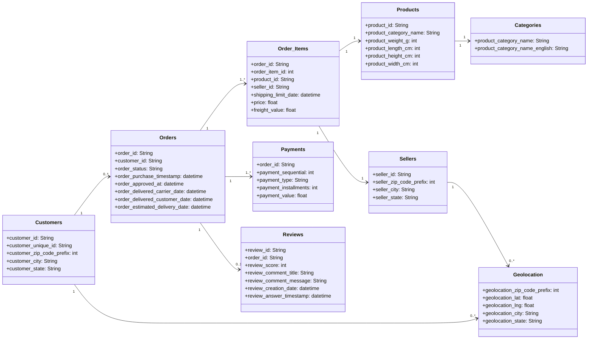

# Modelagem Lógica

```mermaid 
classDiagram
    direction LR

    class Customers {
        +customer_id: String
        +customer_unique_id: String
        +customer_zip_code_prefix: int
        +customer_city: String
        +customer_state: String
    }

    class Orders {
        +order_id: String
        +customer_id: String
        +order_status: String
        +order_purchase_timestamp: datetime
        +order_approved_at: datetime
        +order_delivered_carrier_date: datetime
        +order_delivered_customer_date: datetime
        +order_estimated_delivery_date: datetime
    }

    class Order_Items {
        +order_id: String
        +order_item_id: int
        +product_id: String
        +seller_id: String
        +shipping_limit_date: datetime
        +price: float
        +freight_value: float
    }

    class Products {
        +product_id: String
        +product_category_name: String
        +product_weight_g: int
        +product_length_cm: int
        +product_height_cm: int
        +product_width_cm: int
    }

    class Categories {
        +product_category_name: String
        +product_category_name_english: String
    }

    class Sellers {
        +seller_id: String
        +seller_zip_code_prefix: int
        +seller_city: String
        +seller_state: String
    }

    class Payments {
        +order_id: String
        +payment_sequential: int
        +payment_type: String
        +payment_installments: int
        +payment_value: float
    }

    class Reviews {
        +review_id: String
        +order_id: String
        +review_score: int
        +review_comment_title: String
        +review_comment_message: String
        +review_creation_date: datetime
        +review_answer_timestamp: datetime
    }

    class Geolocation {
        +geolocation_zip_code_prefix: int
        +geolocation_lat: float
        +geolocation_lng: float
        +geolocation_city: String
        +geolocation_state: String
    }

    Customers "1" --> "0..*" Orders
    Orders "1" --> "1..*" Order_Items
    Order_Items "1" --> "1" Products
    Products "1" --> "1" Categories
    Order_Items "1" --> "1" Sellers
    Orders "1" --> "1..*" Payments
    Orders "1" --> "0..1" Reviews
    Customers "1" --> "0..*" Geolocation
    Sellers "1" --> "0..*" Geolocation

```
